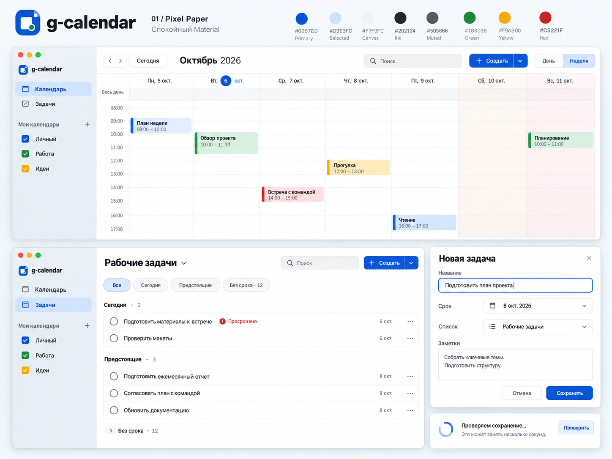
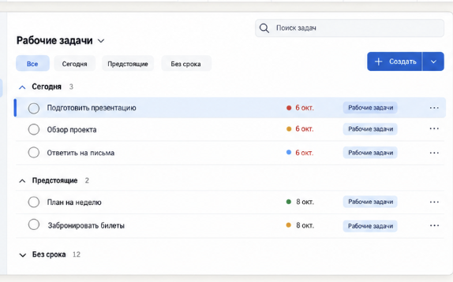

# Выбранный дизайн

Утверждено 2026-10-05: **Pixel Paper + компактный список задач Color Atlas**. Полный контракт — [DESIGN.md](DESIGN.md).

Отвергнутые варианты и промежуточные generation prompts удалены по просьбе владельца. Сохранены только утверждённая система и два нужных референса. [Единый execution plan](../docs/plans/2026-10-05-final-product-completion.md) объединяет implementation, reliability, testing и финальную проверку отступов.
